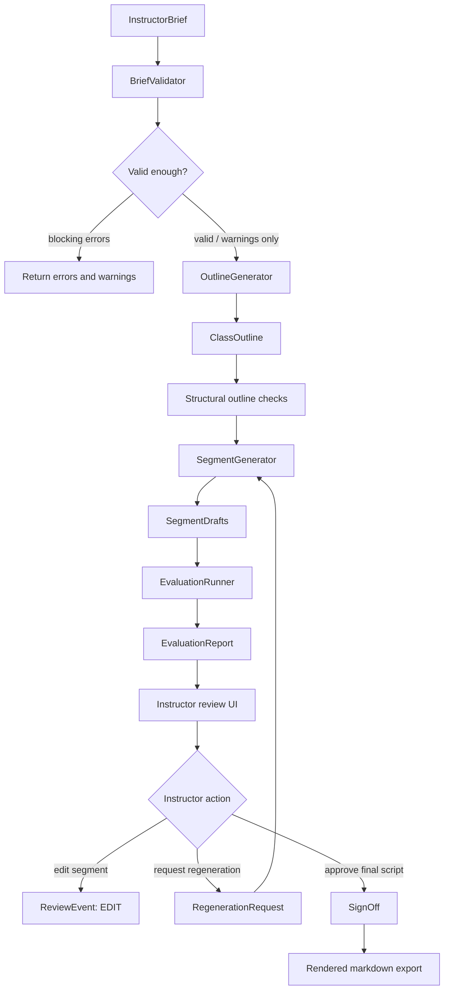
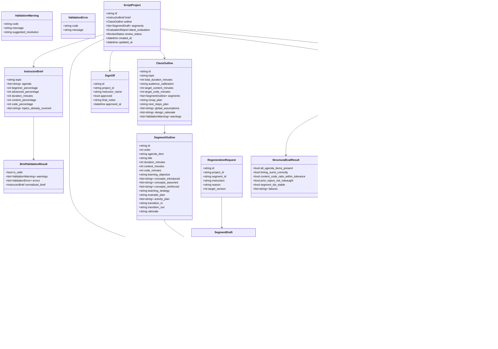

# Class Script Authoring Pipeline - Design

## Design Principle

This system is an outline-first authoring pipeline. The instructor brief is not sent directly to a one-shot script prompt. Instead, the backend first creates a structured class outline that resolves timing, audience level, content/code balance, prior knowledge, and pedagogical order. Segment drafts, activities, review, regeneration, and evaluation all depend on that outline.

The core product idea is:

```text
The system proposes. The instructor disposes.
```

Nothing is considered teach-ready until a human instructor reviews and signs off.

## Pipeline



## Domain Class Diagram



## Service Class Diagram

```mermaid
classDiagram
    class ScriptPipeline {
        +generate_project(InstructorBrief) ScriptProject
        +regenerate_segment(RegenerationRequest) SegmentDraft
        +evaluate_project(string project_id) EvaluationReport
        +sign_off(SignOff) ScriptProject
        +export_markdown(string project_id) string
    }

    class BriefValidator {
        +validate(InstructorBrief) BriefValidationResult
    }

    class OutlineGenerator {
        +generate_outline(InstructorBrief) ClassOutline
    }

    class SegmentGenerator {
        +generate_all(ClassOutline) list~SegmentDraft~
        +generate_segment(SegmentOutline) SegmentDraft
        +regenerate_segment(RegenerationRequest) SegmentDraft
    }

    class EvaluationRunner {
        +run_structural_checks(ScriptProject) StructuralEvalResult
        +run_model_judge(ScriptProject) ModelJudgeResult
        +run_all(ScriptProject) EvaluationReport
    }

    class ReviewService {
        +record_edit(project_id, segment_id, edited_text) ReviewEvent
        +request_regeneration(RegenerationRequest) SegmentDraft
        +approve_project(SignOff) ScriptProject
    }

    class ProjectRepository {
        +create(ScriptProject) ScriptProject
        +get(project_id) ScriptProject
        +save(ScriptProject) ScriptProject
        +append_review_event(ReviewEvent) ReviewEvent
    }

    ScriptPipeline --> BriefValidator
    ScriptPipeline --> OutlineGenerator
    ScriptPipeline --> SegmentGenerator
    ScriptPipeline --> EvaluationRunner
    ScriptPipeline --> ReviewService
    ScriptPipeline --> ProjectRepository
```



## Enums

```python
class ReviewStatus(str, Enum):
    DRAFT = "DRAFT"
    UNDER_REVIEW = "UNDER_REVIEW"
    CHANGES_REQUESTED = "CHANGES_REQUESTED"
    APPROVED = "APPROVED"


class DraftStatus(str, Enum):
    GENERATED = "GENERATED"
    EDITED = "EDITED"
    REGENERATED = "REGENERATED"
    APPROVED = "APPROVED"


class ActivityType(str, Enum):
    CHECKPOINT = "CHECKPOINT"
    QUICK_EXERCISE = "QUICK_EXERCISE"
    LIVE_CODE = "LIVE_CODE"
    DISCUSSION = "DISCUSSION"


class ReviewEventType(str, Enum):
    EDIT = "EDIT"
    REGENERATE_REQUESTED = "REGENERATE_REQUESTED"
    REGENERATED = "REGENERATED"
    APPROVED = "APPROVED"
    COMMENT = "COMMENT"
```

## State And Persistence

The backend should be stateful. A teaching script is an evolving artifact, not a single response.

Persist:

- original brief
- validation warnings
- outline
- segment drafts
- segment versions
- review events
- regeneration requests
- evaluation reports
- final sign-off

For the personal project MVP, SQLite is the right persistence choice: simple to run locally, structured enough for review events and versions, and easier to explain than a full production database.

## Partial Regeneration Contract

Segment regeneration never starts from an empty prompt. The generator receives:

- original brief
- full class outline
- target segment outline
- current target segment draft
- neighboring segment summaries
- prior topics from the brief
- concepts already introduced in previous segments
- instructor regeneration instruction

This preserves flow and avoids re-teaching.

```text
RegenerationRequest
  -> trusted stored project state
  -> target segment only
  -> new SegmentDraft version
  -> ReviewEvent
```

The model supplies intent. The application supplies the trusted state.

## Evaluation Gate

A draft can be shown to the instructor only after the evaluation runner executes. For the personal project, the gate is:

- no blocking structural failures
- all agenda items covered
- timing sum within tolerance
- content/code ratio within tolerance
- prior topics not substantially re-taught
- model judge average above threshold

The golden comparison is included as a designed production path because real instructor scripts are not available inside this personal project repo.

## MVP Scope

Implement fully:

- brief validation
- outline generation
- segment draft generation
- deterministic structural evals
- model judge evals
- review events
- segment-level edit
- segment-level regeneration
- sign-off
- markdown export
- sample outputs

Keep simple:

- activities as small structured objects
- recap and next steps as strings
- audience calibration as a string
- ratio plan as target/actual minute fields

Document, but do not require real data for:

- golden human-authored comparison
- long-term learning from instructor edits
- multi-instructor workflows

## Requirement Mapping

| Personal project requirement | Design support |
|---|---|
| Structured instructor brief | `InstructorBrief` |
| Missing optional prior topics | default `topics_already_covered = []` |
| Internally inconsistent inputs | `BriefValidator`, `ValidationWarning`, `ValidationError` |
| Covers every agenda item | one `SegmentOutline` per agenda item |
| Fits duration | segment `duration_minutes` sum to `ClassOutline.total_duration_minutes` |
| Respects content/code ratio | target/actual content and code minute fields |
| Beginner/advanced adaptivity | `audience_calibration`, `teaching_strategy`, concepts assumed/introduced |
| Pedagogical soundness | concept tracking across segment outlines |
| Comprehension checkpoints | `ComprehensionCheck` and `Activity` |
| Transitions | `transition_in`, `transition_out` |
| Opening/recap/next | outline-level framing, `recap_plan`, `next_steps_plan` |
| Easy review | stable segment IDs, segment drafts, reviewer rationale |
| Partial regeneration | `RegenerationRequest` targets one `segment_id` |
| Capture edits | `ReviewEvent` with before/after and versions |
| Human sign-off | `SignOff`, `ReviewStatus.APPROVED` |
| Deterministic eval | `StructuralEvalResult` |
| LLM judge eval | `ModelJudgeResult` |
| Human script comparison | `GoldenComparisonPlan` |
| Go/no-go gate | `EvaluationReport.passed_gate` |
| Runnable app | `ScriptPipeline` behind FastAPI endpoints and React UI |

## FastAPI Surface

Minimal endpoints:

```text
POST   /projects
GET    /projects/{project_id}
POST   /projects/{project_id}/segments/{segment_id}/edit
POST   /projects/{project_id}/segments/{segment_id}/regenerate
POST   /projects/{project_id}/evaluate
POST   /projects/{project_id}/sign-off
GET    /projects/{project_id}/export/markdown
```

## React Surface

Minimal screens:

- brief form
- generation progress
- outline/script review view
- segment editor
- regenerate segment dialog
- evaluation report panel
- final sign-off/export view

