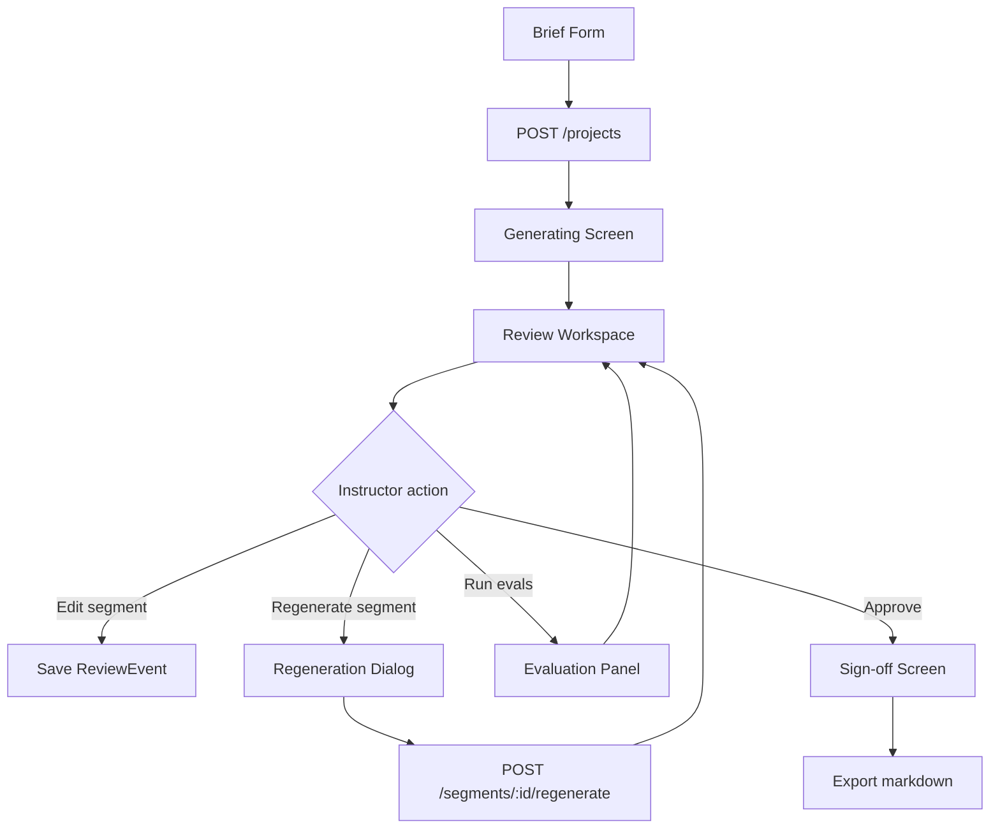
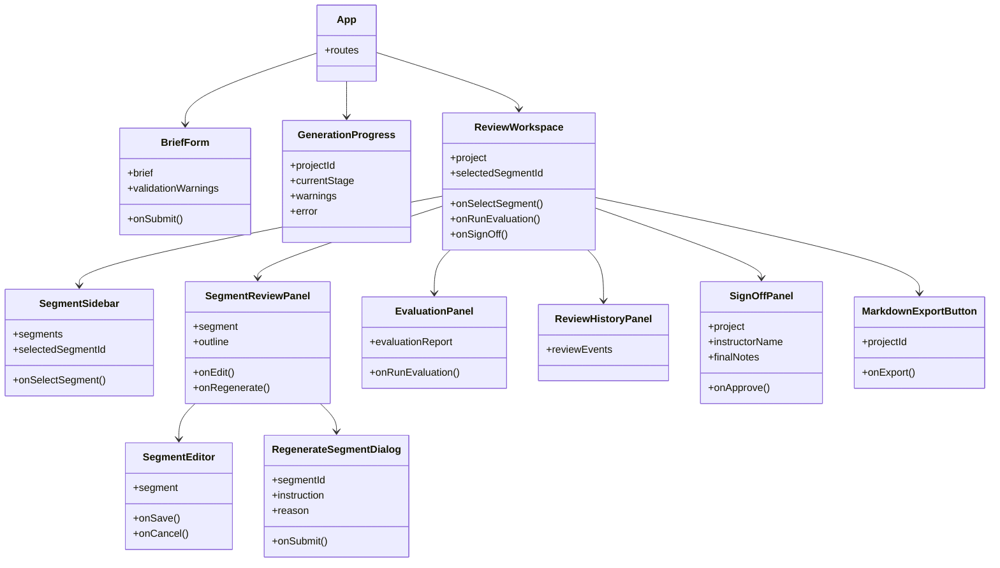

# Frontend Design

## Frontend Principle

The frontend is an instructor review workspace, not a classroom playback product and not a marketing page. Its job is to make the pipeline visible and controllable:

```text
brief constraints -> outline plan -> generated script -> eval results -> instructor edits -> sign-off
```

The instructor should always be able to answer:

- What did I ask the system to generate?
- How did the system plan the class?
- Where is each agenda item covered?
- Does the script fit time, level, and content/code ratio?
- What needs review or regeneration?
- Has a human approved the final script?

## Frontend Interaction Model

The review flow is organized around a standard generation-and-approval workspace:

```text
Home input screen
  -> generation preview/progress
  -> outline review editor
  -> classroom/stage view with scene sidebar
  -> edit/regeneration tools
```

The product scope stays focused on class-script review, not classroom playback.

| Interaction pattern | Our implementation |
|---|---|
| Home prompt/input surface | Structured instructor brief form |
| Generation preview | Script generation progress screen |
| Streaming outline review | Class outline review summary |
| Scene sidebar | Segment sidebar |
| Main classroom scene | Selected segment script panel |
| Scene regeneration | Segment regeneration |
| Editor agent/tool cards | Regeneration dialog and review history |
| Classroom completion | Final sign-off and markdown export |

## Application Routes

```text
/                         Brief form
/projects/:id/generating  Generation progress
/projects/:id/review      Script review workspace
/projects/:id/final       Sign-off and export
```

For the MVP, these can be implemented with React Router. The UI should remain simple and fast to demo.

## Screen Flow



## Screen 1: Brief Form

Purpose: collect the personal project's structured input contract.

Fields:

- topic
- agenda items
- beginner percentage
- advanced percentage
- duration minutes
- content percentage
- code percentage
- topics already covered

Behavior:

- validate percentages sum to 100
- allow adding/removing/reordering agenda items
- show non-blocking warnings before generation when inputs are tense, such as too many agenda items for the duration
- submit to `POST /projects`

Component:

```text
BriefForm
```

## Screen 2: Generation Progress

Purpose: show that generation is staged, not a single opaque model call.

Stages:

```text
1. Validating brief
2. Generating class outline
3. Generating segment drafts
4. Running evaluations
5. Ready for instructor review
```

Behavior:

- show current stage
- show warnings if validation produced them
- navigate automatically or with a button to the review workspace when ready

Component:

```text
GenerationProgress
```

## Screen 3: Review Workspace

Purpose: the main instructor workflow.

Layout:

```text
----------------------------------------------------
Top bar: Project title | Eval status | Export | Sign off
----------------------------------------------------
Left sidebar              Main panel
----------------------------------------------------
1. Opening / Hook         Selected segment script
2. Agenda item 1          - instructor narration
3. Agenda item 2          - live-code steps
4. Agenda item 3          - worked examples
5. Recap                  - checkpoints / activities
                           - reviewer rationale
                           - edit / regenerate controls
----------------------------------------------------
Right drawer / panel
- Brief summary
- Outline timing
- Content/code ratio
- Evaluation report
- Review history
----------------------------------------------------
```

The left sidebar should make the segment structure obvious. Each segment row should show:

- order
- title
- duration
- status
- warnings, if any

The main panel should show:

- segment title
- agenda item
- timing
- content/code split
- learning objective
- instructor narration
- live-code steps
- examples
- checks/activities
- transition in/out
- reviewer rationale
- edit button
- regenerate button

Components:

```text
ReviewWorkspace
SegmentSidebar
SegmentReviewPanel
SegmentEditor
RegenerateSegmentDialog
EvaluationPanel
ReviewHistoryPanel
```

## Screen 4: Sign-off And Export

Purpose: make human approval a real required step.

Behavior:

- show final script status
- show whether eval gate passed
- allow instructor name and final notes
- submit sign-off
- export final markdown

Components:

```text
SignOffPanel
MarkdownExportButton
```

## Component Hierarchy



## Data Fetching

Minimal API usage:

```text
POST /projects
GET /projects/{project_id}
POST /projects/{project_id}/segments/{segment_id}/edit
POST /projects/{project_id}/segments/{segment_id}/regenerate
POST /projects/{project_id}/evaluate
POST /projects/{project_id}/sign-off
GET /projects/{project_id}/export/markdown
```

For the MVP, polling is enough for generation progress. Server-sent events are not required. If generation is synchronous in the first implementation, the progress screen can still display staged status from the response lifecycle or a simple job object.

## UX Requirements

The interface should be:

- operational and review-oriented
- dense enough for repeated instructor use
- visibly structured around segments
- explicit about warnings and eval failures
- clear about human sign-off status
- simple enough to demo without explaining hidden state

Avoid:

- marketing hero pages
- decorative dashboards
- classroom playback complexity
- slide/canvas editing
- agent chat UI
- multi-user workflow

## Visual Direction

Use a restrained SaaS/editor style:

- left navigation/sidebar for segments
- top status/action bar
- main content editor/review surface
- right-side collapsible details panel
- small badges for status and warnings
- clear primary actions: generate, save edit, regenerate, approve, export

Recommended component choices:

- buttons with icons for edit, regenerate, export, approve
- textarea for freeform instructor edits
- dialog for regeneration instruction
- tabs or collapsible sections for outline/eval/history
- badges for segment status
- simple progress steps for generation

## Requirement Mapping

| Personal project requirement | Frontend support |
|---|---|
| Submit structured brief | `BriefForm` |
| View generated script | `ReviewWorkspace`, `SegmentReviewPanel` |
| Human review | segment-by-segment review UI |
| Partial regeneration | `RegenerateSegmentDialog` |
| Capture edits | `SegmentEditor` writes review events |
| Final sign-off | `SignOffPanel` |
| Faithfulness visible | outline timing and ratio panels |
| Evaluation visible | `EvaluationPanel` |
| Reviewable structure | `SegmentSidebar` and stable segment IDs |
| Sample/demo clarity | routes mirror pipeline stages |

## MVP Acceptance Criteria

The frontend is complete enough when an instructor can:

1. Fill out a structured brief.
2. Generate a project.
3. See progress through the pipeline.
4. Review the outline and segment drafts.
5. Edit a single segment.
6. Regenerate a single segment with an instruction.
7. See deterministic/model eval results.
8. Approve the script.
9. Export the final script as markdown.
